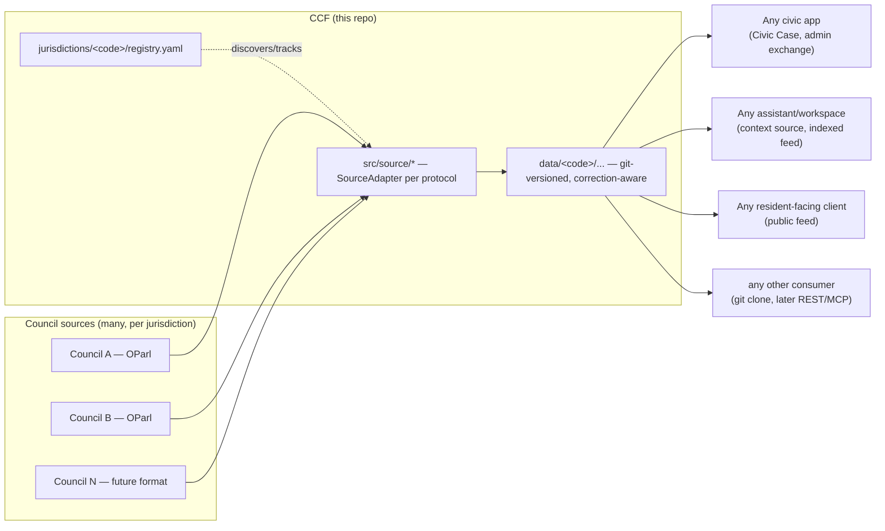

# CCF — Council Context Feed

A standalone service that discovers, pulls, and normalises council/
parliamentary-information-system output into a versioned, correction-aware
feed with a registry — independent of any consumer and not tied to any one
country's protocol or council.

## Coverage

| Country | Councils covered | Total councils | Format |
|---|---|---|---|
| 🇩🇪 Germany | 4 | ~11,200 | OParl |
| 🇬🇧 United Kingdom | 0 | ~372 | none yet |

"Councils covered" is verified entries in that jurisdiction's registry
(`jurisdictions/<code>/registry.yaml`), not endpoints merely claimed
somewhere to exist. See each jurisdiction's own `RESEARCH.md` for how its
total was derived and what a "council" means there — the unit isn't the same
shape in every country.

<details>
<summary>Germany: ~11,200 municipal + district bodies</summary>

- ~10,780 independent municipalities (Gemeinden), per the most recent
  Destatis count — down slowly each year through mergers (was ~11,000 a
  decade ago).
- 294 Landkreise (rural districts) plus ~107 kreisfreie Städte (independent
  cities holding district-level competencies) — ~400 district-level bodies.
- 16 Länder parliaments are out of scope — those aren't municipal.
- City-states add a wrinkle: Berlin has 12 Bezirke with their own BVVs
  (borough assemblies), Hamburg has 7.

So ~10,800 municipal + ~400 district bodies ≈ 11,200, each potentially
running its own RIS vendor, own OParl conformance level (or none), own
quirks. Most small Gemeinden don't run their own RIS at all — they're
administered jointly through an Amt or Verwaltungsgemeinschaft, which is the
actual OParl endpoint owner for a cluster of villages. The number of
distinct *endpoints* is meaningfully lower than 11,200 — likely a few
thousand. See `jurisdictions/de/RESEARCH.md` for the live survey.

</details>

<details>
<summary>United Kingdom: ~372 principal local authorities</summary>

- 307 local authorities in England (as of May 2026 — this number is falling
  as county/district areas convert to unitary authorities under ongoing
  local government reorganisation).
- 32 unitary authorities in Scotland.
- 22 unitary authorities in Wales.
- 11 unitary authorities in Northern Ireland.

≈372 principal authorities total. Below that sits a separate lower tier of
roughly 10,000 town, parish, and community councils, which is a different
scale problem from Germany's Amt-clustering and not in scope for a first
adapter. No UK-wide standard equivalent to OParl exists yet — councils
publish committee/agenda data through several proprietary systems
(ModernGov, CMIS, Egenda, and others), each with its own API or none at all.
A UK adapter has not been started; this row exists to make the gap visible,
not to claim coverage.

</details>

## How it fits with other projects

CCF is upstream of every consumer, and consumers never write back through it
— correction only ever flows from the source council, not from a downstream
app.



Nothing consumes CCF directly today — the arrows out of `data/` describe the
intended shape, not a wired integration.

## Status

Registry loading and the OParl adapter's `pull` are real. `jurisdictions/
de/registry.yaml` has four hand-verified German OParl endpoints, and `cargo
run` walks each one's `system -> body -> {meeting, paper}` graph and
normalises what it finds. Writing the result into `data/` and committing it
is not implemented yet — that code path is an explicit "not implemented"
message rather than a stub that silently does the wrong thing.

## Design intent

**A monorepo, split by what's reusable vs. what's per-jurisdiction.**
`src/` (the `SourceAdapter` trait, the normalised record shape, the CLI) is
jurisdiction-agnostic and shared. `jurisdictions/<code>/` holds each
jurisdiction's own registry and survey research — content, not code. OParl is
one protocol, not the project's assumption: a jurisdiction that doesn't
speak OParl (the UK, today) gets its own `SourceAdapter` implementation in
`src/` plus its own `jurisdictions/<code>/` directory, without touching any
other jurisdiction's.

**Versioned like git, because it is git.** Normalised records are committed
straight into this repository's history, one pull per commit, under:

```
data/<jurisdiction>/<council-id>/<record-type>/<source-id>.json
```

A correction (a source's `modified`/`deleted` marker) is a new commit to the
same path, not an overwrite — `git log --follow` on any file is that
object's correction history for free, and `git diff` between two pulls is
the delta a consumer actually wants. No separate versioned-store engine is
needed to get that property.

## Layout

- `jurisdictions/de/registry.yaml` — known German councils, their OParl
  endpoint, and verification status (4 entries; see the file for how they
  were found)
- `jurisdictions/de/RESEARCH.md` — the endpoint survey: method, what's live,
  what's dead/blocked and why, vendor landscape observed so far
- `data/` — normalised, git-versioned snapshots per jurisdiction per council
  (empty for now — nothing written yet)
- `src/registry.rs` — `CouncilEntry`/`Registry` types and loader (works)
- `src/normalise.rs` — the normalised record shape all source adapters
  produce
- `src/source/mod.rs` — the `SourceAdapter` trait
- `src/source/oparl.rs` — the OParl adapter (works: walks system → body →
  meeting/paper, paginated)
- `src/main.rs` — CLI entrypoint: loads the German registry, pulls each
  verified council, prints record counts; writing into `data/` not
  implemented yet

## Next steps (not started)

1. Implement the write step in `main.rs`: persist pulled records to `data/`
   and commit.
2. Decide pull cadence (weekly registry health check / daily-or-cheaper
   content diff against each object's `modified` timestamp).
3. Expand `jurisdictions/de/registry.yaml` beyond four councils — see
   RESEARCH.md's "next steps" for where the survey left off.
4. Start a UK jurisdiction: survey which proprietary committee-management
   systems are actually in use, and whether any expose a stable enough API
   to normalise against before writing a `SourceAdapter` for it.

## Local setup

```
cargo run
```

This loads the German registry and pulls each verified council for real. It
does not write to `data/` or index anything persistently yet — that's
intentional, not a bug.
